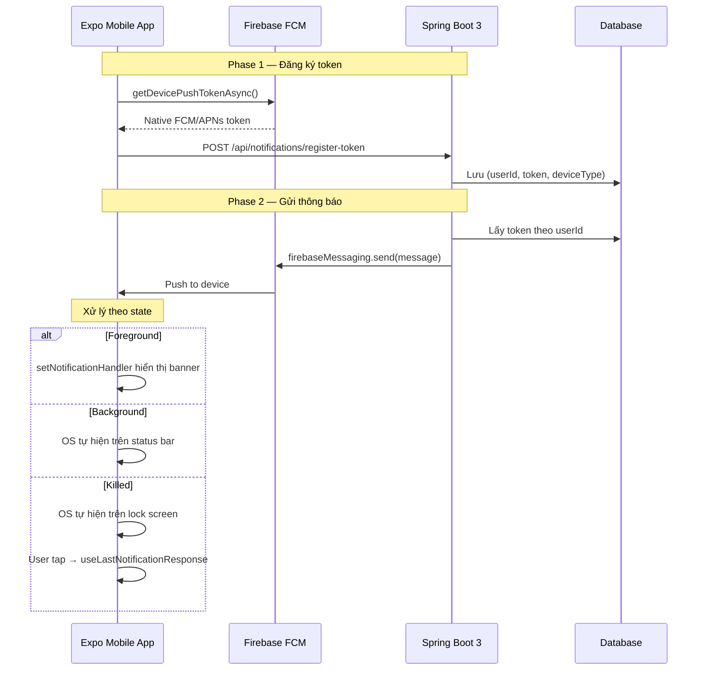

# Push Notification: Hướng dẫn toàn diện

**Stack:** Expo SDK 55 (CNG) · Spring Boot 3 · Firebase Cloud Messaging

---

## Mục lục

1. [Tổng quan kiến trúc](#1-tổng-quan-kiến-trúc)
2. [Hiểu về Expo CNG — vì sao không có folder android/ios](#2-hiểu-về-expo-cng)
3. [Setup Firebase Console](#3-setup-firebase-console)
4. [Backend: Spring Boot 3](#4-backend-spring-boot-3)
5. [Mobile: Expo](#5-mobile-expo)
6. [Tạo Development Build](#6-tạo-development-build)
7. [Test toàn bộ luồng](#7-test-toàn-bộ-luồng)
8. [Troubleshooting](#8-troubleshooting)
9. [Checklist tổng kết](#9-checklist-tổng-kết)

---

## 1. Tổng quan kiến trúc



**Ba thành phần chính:**

| Thành phần | Vai trò | Token nào? |
|------------|---------|------------|
| Expo Mobile | Đăng ký device, nhận noti, hiển thị | `getDevicePushTokenAsync()` → FCM/APNs token |
| Firebase FCM | Cloud relay service | — |
| Spring Boot 3 | Backend gửi notification | Firebase Admin SDK với service account JSON |

**Vì sao chọn `getDevicePushTokenAsync()` thay vì `getExpoPushTokenAsync()`?** Bạn đã có Spring Boot + Firebase Admin SDK rồi — gửi thẳng qua FCM sẽ không cần thêm hop trung gian qua Expo Push Service. Ít một service trong chain = ít một điểm fail.

---

## 2. Hiểu về Expo CNG

### Vì sao project không có folder android/ và ios/?

Project tạo bởi `create-expo-app` mặc định dùng **Continuous Native Generation (CNG)**:

- Mọi cấu hình native (permission, package name, plist, gradle...) đều ở **`app.json`**.
- Folder `android/` và `ios/` **được sinh ra tự động** khi cần build.
- Bạn **không bao giờ commit** hai folder này vào git (đã có sẵn trong `.gitignore`).

Mỗi lần thay đổi `app.json` hoặc cài plugin mới, Expo regenerate lại folder native từ template. Đây là điểm khác biệt lớn nhất giữa **Expo managed (CNG)** và **bare React Native**.

### Khi nào folder android/ios được sinh ra?

Có 3 cách trigger:

**1. Chạy app local trên thiết bị/emulator:**
```bash
npx expo run:android   # Tự prebuild → compile → install
npx expo run:ios       # Tương tự cho iOS
```

**2. Chạy prebuild thủ công (nếu cần xem code native):**
```bash
npx expo prebuild --clean
```

**3. Build qua EAS (cloud):**
```bash
eas build --profile development --platform android
```
EAS chạy prebuild trên server của Expo, không sinh folder local.

### Quy tắc vàng

> **Không bao giờ sửa trực tiếp file trong `android/` hoặc `ios/`** sau khi prebuild. Lần build sau Expo sẽ overwrite mọi thay đổi của bạn. Mọi config phải qua `app.json` hoặc config plugin.

---

## 3. Setup Firebase Console

### 3.1. Tạo Firebase Project

Truy cập [console.firebase.google.com](https://console.firebase.google.com) → **Add project** → đặt tên (ví dụ `social-mobile-app`) → tắt Google Analytics nếu chưa cần → **Create project**.

### 3.2. Thêm Android App

Trong project Firebase:

1. Click icon **Android** (`</>` hoặc Android icon) trên trang Overview.
2. Nhập `applicationId` Android — phải khớp với `expo.android.package` trong `app.json` (ví dụ `com.yourcompany.socialmobile`).
3. Bỏ qua SHA-1 (chỉ cần khi dùng Google Sign-In, Phone Auth).
4. **Tải `google-services.json`** về máy.
5. Bỏ qua các bước "Add Firebase SDK" và "Verify" — Expo lo cho bạn.

### 3.3. Thêm iOS App (nếu cần)

1. Click icon **iOS** trên trang Overview.
2. Nhập `bundleIdentifier` — khớp với `expo.ios.bundleIdentifier` trong `app.json`.
3. **Tải `GoogleService-Info.plist`** về máy.

### 3.4. Upload APNs Auth Key (chỉ cho iOS)

iOS bắt buộc có APNs key thì FCM mới deliver được:

1. Vào [Apple Developer](https://developer.apple.com/account/resources/authkeys/list) → Keys → **+** tạo key mới với capability **Apple Push Notifications service (APNs)**.
2. Tải file `.p8` về (chỉ tải được 1 lần, lưu cẩn thận!). Note lại **Key ID** và **Team ID**.
3. Trong Firebase Console: **Project Settings → Cloud Messaging → Apple app configuration → Upload** file `.p8` cùng với Key ID + Team ID.

### 3.5. Tạo Service Account cho Backend

Để Spring Boot có credential gửi noti:

1. Firebase Console → **Project Settings** (icon bánh răng) → tab **Service accounts**.
2. Click **Generate new private key** → confirm → tải file JSON về.
3. Đổi tên thành `firebase-service-account.json` cho dễ nhớ.

> **Bảo mật:** File này có quyền ADMIN trên Firebase project. **Tuyệt đối không** commit vào git, **không** bundle vào app mobile, **không** đăng public bất kỳ đâu. Chỉ tồn tại trên server backend.

---

## 4. Backend: Spring Boot 3

### 4.1. Cấu trúc project

```
backend/
├── src/main/
│   ├── java/com/example/notification/
│   │   ├── NotificationApplication.java
│   │   ├── config/
│   │   │   └── FirebaseConfig.java
│   │   ├── controller/
│   │   │   └── NotificationController.java
│   │   ├── service/
│   │   │   ├── FcmService.java
│   │   │   └── DeviceTokenService.java
│   │   ├── repository/
│   │   │   └── DeviceTokenRepository.java
│   │   ├── entity/
│   │   │   └── DeviceToken.java
│   │   └── dto/
│   │       ├── NotificationRequest.java
│   │       └── DeviceTokenRequest.java
│   └── resources/
│       ├── application.yml
│       └── firebase/
│           └── firebase-service-account.json   # ← .gitignore!
└── pom.xml
```

### 4.2. Dependencies (`pom.xml`)

```xml
<dependencies>
    <dependency>
        <groupId>org.springframework.boot</groupId>
        <artifactId>spring-boot-starter-web</artifactId>
    </dependency>
    <dependency>
        <groupId>org.springframework.boot</groupId>
        <artifactId>spring-boot-starter-data-jpa</artifactId>
    </dependency>
    <dependency>
        <groupId>com.google.firebase</groupId>
        <artifactId>firebase-admin</artifactId>
        <version>9.4.3</version>
    </dependency>
    <dependency>
        <groupId>org.projectlombok</groupId>
        <artifactId>lombok</artifactId>
        <optional>true</optional>
    </dependency>
    <!-- Database driver: postgres / mysql / h2... -->
</dependencies>
```

### 4.3. Cấu hình `application.yml`

```yaml
spring:
  datasource:
    url: jdbc:postgresql://localhost:5432/notification_db
    username: postgres
    password: ${DB_PASSWORD}
  jpa:
    hibernate:
      ddl-auto: update
    show-sql: false

firebase:
  config-path: firebase/firebase-service-account.json

server:
  port: 8080
```

Thêm vào `.gitignore`:

```
src/main/resources/firebase/firebase-service-account.json
```

### 4.4. Initialize Firebase

`config/FirebaseConfig.java`:

```java
package com.example.notification.config;

import com.google.auth.oauth2.GoogleCredentials;
import com.google.firebase.FirebaseApp;
import com.google.firebase.FirebaseOptions;
import com.google.firebase.messaging.FirebaseMessaging;
import org.springframework.beans.factory.annotation.Value;
import org.springframework.context.annotation.Bean;
import org.springframework.context.annotation.Configuration;
import org.springframework.core.io.ClassPathResource;

import java.io.IOException;
import java.io.InputStream;

@Configuration
public class FirebaseConfig {

    @Value("${firebase.config-path}")
    private String firebaseConfigPath;

    @Bean
    public FirebaseApp firebaseApp() throws IOException {
        try (InputStream serviceAccount = 
                new ClassPathResource(firebaseConfigPath).getInputStream()) {
            FirebaseOptions options = FirebaseOptions.builder()
                    .setCredentials(GoogleCredentials.fromStream(serviceAccount))
                    .build();

            if (FirebaseApp.getApps().isEmpty()) {
                return FirebaseApp.initializeApp(options);
            }
            return FirebaseApp.getInstance();
        }
    }

    @Bean
    public FirebaseMessaging firebaseMessaging(FirebaseApp firebaseApp) {
        return FirebaseMessaging.getInstance(firebaseApp);
    }
}
```

### 4.5. DTOs

`dto/DeviceTokenRequest.java`:

```java
package com.example.notification.dto;

public record DeviceTokenRequest(
    Long userId,
    String token,
    String deviceType   // "android" | "ios"
) {}
```

`dto/NotificationRequest.java`:

```java
package com.example.notification.dto;

import java.util.Map;

public record NotificationRequest(
    String title,
    String body,
    Map<String, String> data
) {}
```

### 4.6. Entity & Repository

`entity/DeviceToken.java`:

```java
package com.example.notification.entity;

import jakarta.persistence.*;
import lombok.Data;
import java.time.LocalDateTime;

@Data
@Entity
@Table(
    name = "device_tokens",
    uniqueConstraints = @UniqueConstraint(columnNames = {"user_id", "token"}),
    indexes = @Index(name = "idx_user_id", columnList = "user_id")
)
public class DeviceToken {
    @Id
    @GeneratedValue(strategy = GenerationType.IDENTITY)
    private Long id;

    @Column(name = "user_id", nullable = false)
    private Long userId;

    @Column(nullable = false, length = 4096)
    private String token;

    @Column(name = "device_type", length = 16)
    private String deviceType;

    @Column(name = "created_at")
    private LocalDateTime createdAt;

    @Column(name = "last_used_at")
    private LocalDateTime lastUsedAt;
}
```

`repository/DeviceTokenRepository.java`:

```java
package com.example.notification.repository;

import com.example.notification.entity.DeviceToken;
import org.springframework.data.jpa.repository.JpaRepository;

import java.util.List;
import java.util.Optional;

public interface DeviceTokenRepository extends JpaRepository<DeviceToken, Long> {
    List<DeviceToken> findByUserId(Long userId);
    Optional<DeviceToken> findByUserIdAndToken(Long userId, String token);
    void deleteByToken(String token);
}
```

### 4.7. Token Management Service

`service/DeviceTokenService.java`:

```java
package com.example.notification.service;

import com.example.notification.entity.DeviceToken;
import com.example.notification.repository.DeviceTokenRepository;
import lombok.RequiredArgsConstructor;
import org.springframework.stereotype.Service;
import org.springframework.transaction.annotation.Transactional;

import java.time.LocalDateTime;
import java.util.List;

@Service
@RequiredArgsConstructor
public class DeviceTokenService {

    private final DeviceTokenRepository repo;

    @Transactional
    public void registerToken(Long userId, String token, String deviceType) {
        repo.findByUserIdAndToken(userId, token).ifPresentOrElse(
            existing -> {
                existing.setLastUsedAt(LocalDateTime.now());
                repo.save(existing);
            },
            () -> {
                DeviceToken dt = new DeviceToken();
                dt.setUserId(userId);
                dt.setToken(token);
                dt.setDeviceType(deviceType);
                dt.setCreatedAt(LocalDateTime.now());
                dt.setLastUsedAt(LocalDateTime.now());
                repo.save(dt);
            }
        );
    }

    public List<String> getTokensByUserId(Long userId) {
        return repo.findByUserId(userId).stream()
                .map(DeviceToken::getToken)
                .toList();
    }

    @Transactional
    public void removeInvalidToken(String token) {
        repo.deleteByToken(token);
    }
}
```

### 4.8. FCM Service

`service/FcmService.java`:

```java
package com.example.notification.service;

import com.google.firebase.messaging.*;
import lombok.RequiredArgsConstructor;
import lombok.extern.slf4j.Slf4j;
import org.springframework.stereotype.Service;

import java.util.List;
import java.util.Map;

@Slf4j
@Service
@RequiredArgsConstructor
public class FcmService {

    private final FirebaseMessaging firebaseMessaging;
    private final DeviceTokenService tokenService;

    /**
     * Gửi đến 1 thiết bị.
     * Tự động xóa token nếu nhận UNREGISTERED/INVALID_ARGUMENT.
     */
    public String sendToToken(String token, String title, String body, 
                              Map<String, String> data) throws FirebaseMessagingException {
        Message message = Message.builder()
                .setToken(token)
                .setNotification(Notification.builder()
                        .setTitle(title)
                        .setBody(body)
                        .build())
                .putAllData(data == null ? Map.of() : data)
                .setAndroidConfig(androidConfig())
                .setApnsConfig(apnsConfig())
                .build();

        try {
            String response = firebaseMessaging.send(message);
            log.info("FCM sent: {}", response);
            return response;
        } catch (FirebaseMessagingException e) {
            handleSendError(e, token);
            throw e;
        }
    }

    /**
     * Gửi đến nhiều token cùng lúc (max 500).
     */
    public BatchResponse sendToMultipleTokens(List<String> tokens, String title, 
                                               String body, Map<String, String> data) 
            throws FirebaseMessagingException {
        MulticastMessage message = MulticastMessage.builder()
                .addAllTokens(tokens)
                .setNotification(Notification.builder()
                        .setTitle(title).setBody(body).build())
                .putAllData(data == null ? Map.of() : data)
                .setAndroidConfig(androidConfig())
                .setApnsConfig(apnsConfig())
                .build();

        BatchResponse response = firebaseMessaging.sendEachForMulticast(message);
        log.info("Multicast: {} success, {} failed",
                response.getSuccessCount(), response.getFailureCount());

        // Xóa các token bị lỗi
        for (int i = 0; i < response.getResponses().size(); i++) {
            SendResponse sr = response.getResponses().get(i);
            if (!sr.isSuccessful() && isInvalidToken(sr.getException())) {
                tokenService.removeInvalidToken(tokens.get(i));
            }
        }
        return response;
    }

    private void handleSendError(FirebaseMessagingException e, String token) {
        if (isInvalidToken(e)) {
            log.warn("Removing invalid token: {}", token);
            tokenService.removeInvalidToken(token);
        }
    }

    private boolean isInvalidToken(FirebaseMessagingException e) {
        if (e == null) return false;
        MessagingErrorCode code = e.getMessagingErrorCode();
        return code == MessagingErrorCode.UNREGISTERED 
            || code == MessagingErrorCode.INVALID_ARGUMENT;
    }

    private AndroidConfig androidConfig() {
        return AndroidConfig.builder()
                .setPriority(AndroidConfig.Priority.HIGH)
                .setNotification(AndroidNotification.builder()
                        .setChannelId("default")     // ← phải khớp client
                        .setSound("default")
                        .build())
                .build();
    }

    private ApnsConfig apnsConfig() {
        return ApnsConfig.builder()
                .setAps(Aps.builder()
                        .setSound("default")
                        .setContentAvailable(true)
                        .build())
                .build();
    }
}
```

### 4.9. REST Controller

`controller/NotificationController.java`:

```java
package com.example.notification.controller;

import com.example.notification.dto.DeviceTokenRequest;
import com.example.notification.dto.NotificationRequest;
import com.example.notification.service.DeviceTokenService;
import com.example.notification.service.FcmService;
import com.google.firebase.messaging.BatchResponse;
import com.google.firebase.messaging.FirebaseMessagingException;
import lombok.RequiredArgsConstructor;
import org.springframework.http.ResponseEntity;
import org.springframework.web.bind.annotation.*;

import java.util.List;

@RestController
@RequestMapping("/api/notifications")
@RequiredArgsConstructor
public class NotificationController {

    private final FcmService fcmService;
    private final DeviceTokenService tokenService;

    @PostMapping("/register-token")
    public ResponseEntity<Void> registerToken(@RequestBody DeviceTokenRequest req) {
        tokenService.registerToken(req.userId(), req.token(), req.deviceType());
        return ResponseEntity.ok().build();
    }

    @PostMapping("/send/{userId}")
    public ResponseEntity<String> sendToUser(
            @PathVariable Long userId,
            @RequestBody NotificationRequest req) throws FirebaseMessagingException {
        List<String> tokens = tokenService.getTokensByUserId(userId);
        if (tokens.isEmpty()) return ResponseEntity.notFound().build();

        BatchResponse res = fcmService.sendToMultipleTokens(
                tokens, req.title(), req.body(), req.data());
        return ResponseEntity.ok("Sent: " + res.getSuccessCount());
    }
}
```

---

## 5. Mobile: Expo

### 5.1. Cài packages

Trong root project mobile (folder `SOCIAL_MOBILE` của bạn):

```bash
npx expo install expo-notifications expo-device expo-constants
```

> Lưu ý: dùng `npx expo install` thay vì `npm install` / `pnpm add` thông thường, vì lệnh này tự match version compatible với Expo SDK của bạn.

### 5.2. Đặt file Firebase config

Đặt 2 file vừa tải ở Firebase Console vào **root project** (cùng cấp `app.json`):

```
SOCIAL_MOBILE/
├── google-services.json          # ← từ Firebase Android app
├── GoogleService-Info.plist      # ← từ Firebase iOS app (nếu có)
├── app.json
├── package.json
└── src/
```

Thêm vào `.gitignore` nếu repo public:

```gitignore
# Firebase
google-services.json
GoogleService-Info.plist
```

> **Trong team:** thường vẫn commit 2 file này vào repo private vì chúng chỉ là config, không phải secret. File **service account** mới là secret.

### 5.3. Cấu hình `app.json`

Đây là phần quan trọng nhất với Expo CNG. Sửa `app.json`:

```json
{
  "expo": {
    "name": "Social Mobile",
    "slug": "social-mobile",
    "version": "1.0.0",
    "scheme": "socialmobile",
    "orientation": "portrait",
    "icon": "./assets/icon.png",
    "userInterfaceStyle": "automatic",

    "ios": {
      "supportsTablet": false,
      "bundleIdentifier": "com.yourcompany.socialmobile",
      "googleServicesFile": "./GoogleService-Info.plist",
      "infoPlist": {
        "UIBackgroundModes": ["remote-notification"]
      }
    },

    "android": {
      "package": "com.yourcompany.socialmobile",
      "googleServicesFile": "./google-services.json",
      "adaptiveIcon": {
        "foregroundImage": "./assets/adaptive-icon.png",
        "backgroundColor": "#ffffff"
      },
      "permissions": ["POST_NOTIFICATIONS"]
    },

    "plugins": [
      "expo-router",
      [
        "expo-notifications",
        {
          "icon": "./assets/notification-icon.png",
          "color": "#ffffff",
          "defaultChannel": "default"
        }
      ]
    ],

    "experiments": {
      "typedRoutes": true
    }
  }
}
```

**Lưu ý quan trọng:**

- `bundleIdentifier` (iOS) và `package` (Android) **phải khớp** với những gì đã đăng ký ở Firebase Console.
- `notification-icon.png` phải là PNG **đơn sắc trắng nền trong suốt** (Android requirement). Nếu chưa có, tạm bỏ field `"icon"` đi, dùng icon default.
- `defaultChannel: "default"` phải khớp với `channelId` trong code Java backend (`AndroidNotification.builder().setChannelId("default")`).

### 5.4. Notification Service

Tạo `src/services/notificationService.ts`:

```typescript
import * as Notifications from 'expo-notifications';
import * as Device from 'expo-device';
import { Platform } from 'react-native';

// ============================================================================
// CẤU HÌNH HÀNH VI FOREGROUND
// Phải gọi ở module top-level (ngoài React component)
// ============================================================================
Notifications.setNotificationHandler({
  handleNotification: async () => ({
    shouldShowBanner: true,    // Hiện banner trên đầu màn hình
    shouldShowList: true,      // Hiện trong notification center
    shouldPlaySound: true,
    shouldSetBadge: false,
  }),
});

// ============================================================================
// CONFIG
// ============================================================================
const API_BASE_URL = process.env.EXPO_PUBLIC_API_URL ?? 'http://10.0.2.2:8080';

// ============================================================================
// SERVICE
// ============================================================================
class NotificationService {
  /**
   * Tạo channel cho Android (bắt buộc Android 8+).
   * channelId phải khớp với backend.
   */
  async setupAndroidChannel(): Promise<void> {
    if (Platform.OS !== 'android') return;

    await Notifications.setNotificationChannelAsync('default', {
      name: 'Default',
      importance: Notifications.AndroidImportance.HIGH,
      vibrationPattern: [0, 250, 250, 250],
      lightColor: '#FF231F7C',
      sound: 'default',
    });
  }

  /**
   * Xin quyền + lấy native device push token (FCM/APNs).
   * Trả null nếu không phải device thật, hoặc user từ chối.
   */
  async registerForPushNotifications(): Promise<string | null> {
    if (!Device.isDevice) {
      console.warn('Push notification chỉ chạy trên thiết bị thật');
      return null;
    }

    // 1. Permission
    const { status: existingStatus } = await Notifications.getPermissionsAsync();
    let finalStatus = existingStatus;

    if (existingStatus !== 'granted') {
      const { status } = await Notifications.requestPermissionsAsync();
      finalStatus = status;
    }

    if (finalStatus !== 'granted') {
      console.warn('User từ chối quyền notification');
      return null;
    }

    // 2. Channel (Android)
    await this.setupAndroidChannel();

    // 3. Lấy device token
    try {
      const tokenData = await Notifications.getDevicePushTokenAsync();
      console.log(`[${Platform.OS}] device token:`, tokenData.data);
      return tokenData.data;
    } catch (err) {
      console.error('Failed to get device token:', err);
      return null;
    }
  }

  /**
   * Gửi token lên Spring Boot backend.
   */
  async registerTokenWithBackend(userId: number, token: string): Promise<void> {
    try {
      const res = await api.post(`/api/notifications/register-token`,{
          userId,
          token,
          deviceType: Platform.OS,
        });
      console.log('Token registered with backend');
    } catch (err) {
      console.error('Failed to register token:', err);
    }
  }
}

export default new NotificationService();
```

### 5.5. Custom hook (clean architecture)

Tạo `src/hooks/useNotifications.ts`:

```typescript
import { useEffect, useRef } from 'react';
import * as Notifications from 'expo-notifications';
import { useRouter } from 'expo-router';
import notificationService from '@/services/notificationService';

type EventSubscription = ReturnType<typeof Notifications.addNotificationReceivedListener>;

interface UseNotificationsOptions {
  userId: number | null;
  onNotificationTap?: (data: Record<string, any>) => void;
}

export function useNotifications({ userId, onNotificationTap }: UseNotificationsOptions) {
  const router = useRouter();
  const receivedRef = useRef<EventSubscription | null>(null);
  const responseRef = useRef<EventSubscription | null>(null);

  // 1. Đăng ký token + gửi lên backend khi user login
  useEffect(() => {
    if (!userId) return;

    notificationService.registerForPushNotifications().then(token => {
      if (token) notificationService.registerTokenWithBackend(userId, token);
    });
  }, [userId]);

  // 2. Đăng ký các listener
  useEffect(() => {
    receivedRef.current = Notifications.addNotificationReceivedListener(
      notification => {
        console.log('Foreground noti received:', notification.request.content);
      }
    );

    responseRef.current = Notifications.addNotificationResponseReceivedListener(
      response => {
        const data = response.notification.request.content.data;
        console.log('User tapped noti:', data);

        if (onNotificationTap) {
          onNotificationTap(data);
        } else if (data?.screen) {
          router.push(data.screen as any);
        }
      }
    );

    return () => {
      receivedRef.current?.remove();
      responseRef.current?.remove();
    };
  }, [router, onNotificationTap]);

  // 3. Killed state — handle response cuối cùng
  const lastResponse = Notifications.useLastNotificationResponse();
  useEffect(() => {
    if (!lastResponse) return;

    const data = lastResponse.notification.request.content.data;
    if (onNotificationTap) {
      onNotificationTap(data);
    } else if (data?.screen) {
      router.push(data.screen as any);
    }
  }, [lastResponse, router, onNotificationTap]);
}
```

### 5.6. Tích hợp vào root layout

Sửa `src/app/_layout.tsx`:

```typescript
import { Stack } from 'expo-router';
import { useNotifications } from '@/hooks/useNotifications';
// import useAuthStore from '@/stores/authStore'; // dùng store thực tế của bạn

export default function RootLayout() {
  // Tạm hardcode userId. Trong thực tế: lấy từ store/auth
  // const userId = useAuthStore(s => s.user?.id ?? null);
  const userId = 123;

  useNotifications({
    userId,
    onNotificationTap: (data) => {
      console.log('Custom handle tap:', data);
    },
  });

  return (
    <Stack>
      <Stack.Screen name="(tabs)" options={{ headerShown: false }} />
    </Stack>
  );
}
```

### 5.7. Environment variable

Trong `.env` (đã có sẵn trong project):

```bash
# Android emulator: 10.0.2.2 = localhost của máy host
# iOS simulator: localhost trực tiếp
# Device thật: dùng IP LAN của máy dev (vd 192.168.1.100)
EXPO_PUBLIC_API_URL=http://10.0.2.2:8080
```

> Prefix `EXPO_PUBLIC_` là **bắt buộc** để biến env được expose ra client code.

---

## 6. Tạo Development Build

Vì project chưa có folder `android/` và `ios/`, đây là bước sinh ra chúng và build app.

### 6.1. Vì sao bắt buộc Development Build?

Từ **Expo SDK 53+**, push notification (remote) **không hoạt động trong Expo Go nữa**. Bạn cần:

- **Development Build:** binary native chứa `expo-notifications` module + dev tools để hot reload.
- Khác Expo Go ở chỗ: chứa native module riêng của project, có thể test mọi tính năng native.
- Khác production build ở chỗ: vẫn connect được Metro bundler, có dev menu.

### 6.2. Cài `expo-dev-client`

```bash
npx expo install expo-dev-client
```

### 6.3. Cách 1 — Build local (khuyên dùng)

**Yêu cầu:**
- Android: cài Android Studio + JDK 17 + Android SDK
- iOS: macOS + Xcode 15+ + iOS device thật

**Lệnh build + install:**

```bash
# Android — auto prebuild + compile + install lên device/emulator đang connect
npx expo run:android

# iOS — chỉ chạy trên device thật cho push noti
npx expo run:ios --device
```

Lần đầu chạy sẽ:

1. Tự động prebuild → sinh ra folder `android/` và `ios/`.
2. Compile native code (mất 5-10 phút lần đầu).
3. Install APK/IPA lên thiết bị connect qua USB.
4. Khởi động Metro bundler tự động.

Sau khi build xong, các lần sau dev chỉ cần:

```bash
npx expo start --dev-client
```

→ Mở app dev trên device, kết nối Metro, hot reload bình thường.

### 6.4. Cách 2 — Build qua EAS (cloud)

Nếu không có Android Studio / Xcode local, dùng EAS Build:

```bash
npm install -g eas-cli
eas login
eas build:configure   # Nếu chưa có eas.json — bạn đã có rồi
```

Sửa `eas.json` thêm profile development:

```json
{
  "build": {
    "development": {
      "developmentClient": true,
      "distribution": "internal",
      "android": {
        "buildType": "apk"
      },
      "ios": {
        "simulator": false
      }
    },
    "preview": { /* ... */ },
    "production": { /* ... */ }
  }
}
```

Build:

```bash
eas build --profile development --platform android
# hoặc --platform ios
```

EAS chạy build trên cloud, sau ~10-15 phút trả về link APK/IPA. Tải về cài lên máy thật.

### 6.5. Chạy app

```bash
# Khởi động Metro bundler
npx expo start --dev-client
```

Mở app **Development Build** vừa cài lên device → app sẽ tự connect đến Metro → load JS bundle.

> Đừng nhầm giữa **Expo Go** (app chợ Play/App Store) và **Development Build** (app bạn vừa build). App của bạn có icon và tên riêng, không phải Expo Go.

---

## 7. Test toàn bộ luồng

### 7.1. Khởi động backend

```bash
cd backend
./mvnw spring-boot:run
```

Đảm bảo log thấy: `Firebase application has been initialized`.

### 7.2. Khởi động mobile

```bash
cd SOCIAL_MOBILE
npx expo start --dev-client
```

Mở development build trên thiết bị thật → check console Metro thấy log:

```
[android] device token: dKx3...rYz
Token registered with backend
```

Vào DB kiểm tra bảng `device_tokens` đã có record mới với `user_id=123`.

### 7.3. Test 3 trạng thái

**Test A — Foreground (app đang mở, đang xem):**

```bash
curl -X POST http://localhost:8080/api/notifications/send/123 \
  -H "Content-Type: application/json" \
  -d '{
    "title": "Đơn hàng mới",
    "body": "Đơn #1234 cần xác nhận",
    "data": { "screen": "/orders/1234" }
  }'
```

Kết quả: noti hiện banner trên đầu màn hình app.

**Test B — Background (app đã chuyển sang nền):**

1. Bấm Home/swipe để app vào nền (nhưng chưa kill).
2. Gọi lại curl trên.
3. Noti hiện trên status bar / notification center.
4. Tap vào → app mở lại → router push đến `/orders/1234`.

**Test C — Killed (app đã bị tắt hoàn toàn):**

1. Vuốt swipe app khỏi recent apps để kill hẳn.
2. Gọi lại curl.
3. Noti hiện trên lock screen / status bar.
4. Tap vào → app khởi động lại từ đầu → `useLastNotificationResponse` trigger → router push đến `/orders/1234`.

### 7.4. Verify token cleanup

Trên backend, gọi API gửi đến token đã uninstall app:
- Lần đầu: trả về error `UNREGISTERED`.
- `FcmService` tự động xóa token khỏi DB.
- Lần sau gọi `/send/{userId}` chỉ gửi tới các token còn valid.

---

## 8. Troubleshooting

### Bảng tra lỗi nhanh

| Triệu chứng | Nguyên nhân thường gặp | Cách fix |
|-------------|------------------------|----------|
| Token là `null` | Đang test trên Expo Go (SDK 53+) | Phải dùng Development Build |
| Token là `null` trên iOS | Test trên simulator | Dùng device thật + APNs key đã upload |
| Foreground không hiện noti | Quên `setNotificationHandler` ở top-level | Đặt ngoài component, không trong `useEffect` |
| Background không hiện noti | Backend chỉ gửi `data`, thiếu `notification` | Luôn gửi cả 2: `notification` + `data` |
| Killed không hiện noti | Battery optimization của hãng (Xiaomi, Oppo) | Hướng dẫn user disable optimize cho app |
| Icon hình vuông trắng đặc | Icon không phải đơn sắc trắng | PNG monochrome trắng + nền trong suốt |
| Tap noti khi killed không navigate | Listener đăng ký quá chậm | Dùng `useLastNotificationResponse` |
| `default firebaseApp not initialized` | `google-services.json` chưa đặt đúng chỗ | Đặt ở root project + sửa `app.json` |
| Token đổi sau khi reinstall | Bình thường trên Android | Re-register token mỗi lần app start |
| `EXPO_PUBLIC_API_URL` không định nghĩa | Quên prefix `EXPO_PUBLIC_` | Đổi tên biến + restart Metro |

### Lệnh debug hữu ích

```bash
# Xem log Android device thật
npx expo run:android --device

# Clean toàn bộ và prebuild lại
rm -rf android ios node_modules
pnpm install
npx expo prebuild --clean

# Xem xem build có đúng không
npx expo doctor

# Check FCM token đang được lưu
adb shell setprop log.tag.FCM VERBOSE
adb logcat | grep -i fcm
```

### Lỗi phổ biến với Expo CNG

**Lỗi:** Sửa file trong `android/` rồi build → thấy thay đổi mất sau lần prebuild tiếp theo.

**Fix:** Mọi config phải qua `app.json` hoặc viết **config plugin** (advanced). Không sửa trực tiếp folder native.

**Lỗi:** Cài thêm package native xong app crash.

**Fix:** Phải rebuild development build sau khi cài package native mới. JS-only package thì không cần.

---

## 9. Checklist tổng kết

Khi triển khai, đánh dấu từng bước:

### Firebase Console
- [ ] Tạo Firebase project
- [ ] Add Android app với đúng package name → tải `google-services.json`
- [ ] Add iOS app với đúng bundle ID → tải `GoogleService-Info.plist`
- [ ] Upload APNs key (.p8) cho iOS
- [ ] Generate service account JSON cho backend

### Backend Spring Boot 3
- [ ] Thêm `firebase-admin` dependency
- [ ] Đặt `firebase-service-account.json` vào `src/main/resources/firebase/`
- [ ] Thêm vào `.gitignore`
- [ ] Tạo `FirebaseConfig` với `@Bean FirebaseMessaging`
- [ ] Tạo entity `DeviceToken` + repository
- [ ] Tạo `DeviceTokenService` (register, get, remove)
- [ ] Tạo `FcmService` với handle UNREGISTERED error
- [ ] Tạo controller với 2 endpoint: `/register-token`, `/send/{userId}`
- [ ] Test bằng curl

### Mobile Expo
- [ ] `npx expo install expo-notifications expo-device expo-constants expo-dev-client`
- [ ] Đặt `google-services.json` + `GoogleService-Info.plist` vào root project
- [ ] Sửa `app.json`: bundleIdentifier, package, googleServicesFile, plugin expo-notifications
- [ ] Tạo `src/services/notificationService.ts`
- [ ] Tạo `src/hooks/useNotifications.ts`
- [ ] Gọi hook trong `src/app/_layout.tsx`
- [ ] Set `EXPO_PUBLIC_API_URL` trong `.env`

### Build & Test
- [ ] `npx expo run:android` (lần đầu)
- [ ] App install lên device thật
- [ ] Console log thấy device token
- [ ] DB có record device token
- [ ] Test foreground: noti hiện banner
- [ ] Test background: noti hiện status bar
- [ ] Test killed: noti hiện lock screen + tap navigate đúng
- [ ] Test với token invalid: backend tự xóa khỏi DB

---

## Phụ lục: So sánh `getDevicePushTokenAsync` vs `getExpoPushTokenAsync`

| Tiêu chí | `getDevicePushTokenAsync` | `getExpoPushTokenAsync` |
|----------|---------------------------|--------------------------|
| Token format | `dKx3...` (FCM) hoặc base64 (APNs) | `ExponentPushToken[xxxxx]` |
| Backend gửi qua | Firebase Admin SDK / APNs | Expo Push API |
| Setup iOS | Cần APNs key tự cấu hình | Expo Go dùng key của Expo (chỉ trên Expo Go) |
| Push receipt | Phải tự implement | Có sẵn |
| Rate limit | FCM/APNs limits | 600/s, 100/request |
| Latency | 1 hop (FCM/APNs) | 2 hops (Expo → FCM/APNs) |
| Phù hợp với | Đã có backend Firebase | Muốn nhanh, không muốn quản lý credentials |

→ Dự án của bạn đã có Spring Boot + Firebase Admin SDK, nên `getDevicePushTokenAsync` là lựa chọn tự nhiên.

---

**Tài liệu tham khảo:**

- [Expo Notifications docs](https://docs.expo.dev/versions/latest/sdk/notifications/)
- [Expo Push Notifications Setup](https://docs.expo.dev/push-notifications/push-notifications-setup/)
- [Send via FCM directly](https://docs.expo.dev/push-notifications/sending-notifications-custom/)
- [Firebase Admin SDK Java](https://firebase.google.com/docs/admin/setup)
- [Expo Continuous Native Generation](https://docs.expo.dev/workflow/continuous-native-generation/)
